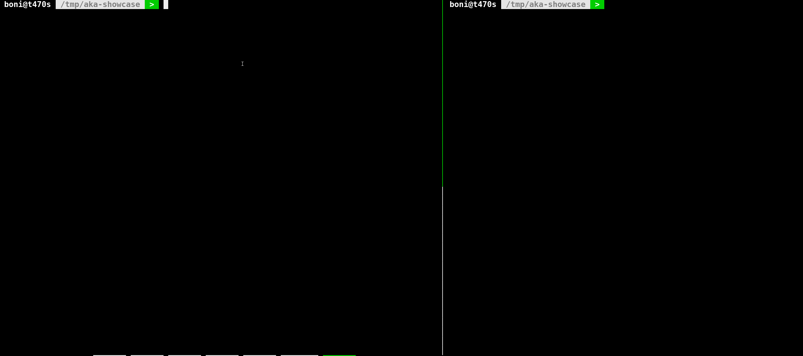

# aka

aka is a simple command-line tool which lets you define per directory config files as aliases for shell commands.

## Motivation

Being an avid user of Linux' `alias` command, oftentimes I found myself frustrated with a couple of "more advanced" use-cases and wanted a really simple tool which would:

- be able to use namespaced (nested) aliases;
- be able to define configuration files in directories which would serve as per-directory-context aliases;
- use simple format for configuration files (as close as possible to `alias` syntax);
- integrate nicely with version control (e.g. add configuration file to the VCS to be shared among team members).

## Usage



---

### Overview
Using `aka` is quite straightforward:

- create an `.aka` text file in a directory where you'd like to be able to use `aka` aliases;
- define your aliases;
- run `aka [your_alias]`.

### Configuration File

Configuration files are actually [Lua](https://www.lua.org/) files which means we're using:

- `lua` strings for regular / simple aliases;
- `lua` tables for namespaced / nested aliases;
- `--` for single line and `[[]]` for multiple line comments.

Here is an example of a configuration file to get started with:
```lua
-- regular aliases
pwd_alias = 'pwd' -- usage: aka pwd_alias
du_alias = 'du -h' -- usage: aka du_alias

-- nested aliases
alias_group = {
  alias_subgroup = {
    list = 'ls -alh' -- usage: aka alias_group alias_subgroup list
  }
}
```
A more practical example could be:

```lua
-- example project's docker containers management commands
docker = {
  bash = {
    django = 'docker exec -i -t $(docker ps -f name=django --format "{{.Names}}") /bin/bash',
    postgres = 'docker exec -i -t $(docker ps -f name=postgres --format "{{.Names}}") /bin/bash'
  },
  build = {
    django = 'docker-compose -f local.yml up --build django',
    postgres = 'docker-compose -f local.yml up --build postgres',
    all = 'docker-compose -f local.yml up --build'
  }
}
```

In the example above we'd be able to use namespaced aliases like this:
- `aka docker bash django` or;
- `aka docker bash postgres` or;
- `aka docker build all`
- etc.

### Command Line Interface

```
aka - per directory shell aliases

Usage:
  aka alias [sub_alias sub_sub_alias ...]
  aka -h|--help

Options:
  -h, --help        Print usage
```

## Installation

### Use Pre-compiled Binary

#### Overview

The goal from the start was for this tool to be easily distributable across Linux machines (not having to have Lua on your system to be able to use `aka`).

With this in mind and the fact that [Lua is small](https://www.lua.org/about.html), pre-compiled x86_64 linux binaries are available for download which contain the entire Lua (interpreter and standard libraries) and `aka` source code.

#### Download

https://github.com/bonidjukic/aka/releases/latest

### Using [LuaRocks](https://luarocks.org) To Install

To install `aka` using `luarocks` package manager, run this command in your terminal:

```
luarocks install aka
```

If you don't have [LuaRocks](https://luarocks.org)  installed, this [document](https://github.com/luarocks/luarocks/wiki/Download)  can guide you through the process.

### Building From Source

#### Prerequisites
Building `aka` from source is possible, but at the moment, [luastatic](https://github.com/ers35/luastatic) command line tool is a prerequisite for the build process.

`luastatic` is used to build a standalone executable from a Lua source code.

#### Building

To build `aka` run:

`make` or `make build`

#### Installing

To install `aka` run:

```make install```

#### Uninstalling

To uninstall `aka` run:

```make uninstall```

## Testing

### Prerequisites

[Busted](https://github.com/Olivine-Labs/busted) unit testing framework is required to run the tests.

### Running The Tests

Navigate to `aka` project's root directory and run:

```
busted
```

## Roadmap

There are a couple of features I'm planning to add in the near future:

- ability to list all aliases from the current directory's `.aka` config file
- ability to define `.aka.local` config file which could be used to override aliases from `.aka` config (useful when `.aka` is added to VCS and you'd like to have a different local version of a certain alias)

## Versioning

[SemVer](http://semver.org/) is used for versioning. For the versions available, see the [tags on this repository](https://github.com/bonidjukic/aka/tags).

## License

This project is licensed under the GNU General Public License v3.0 - see the [LICENSE.md](LICENSE.md) file for details.
